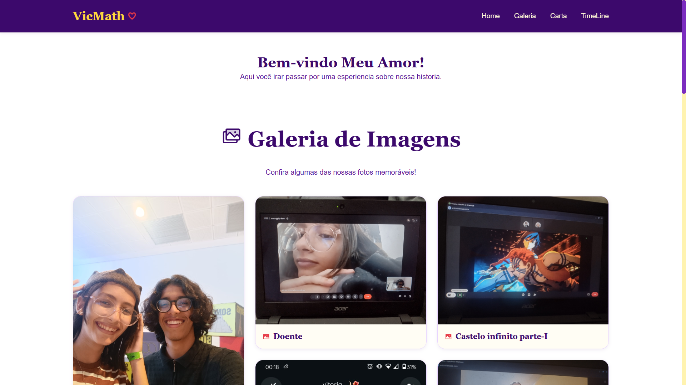
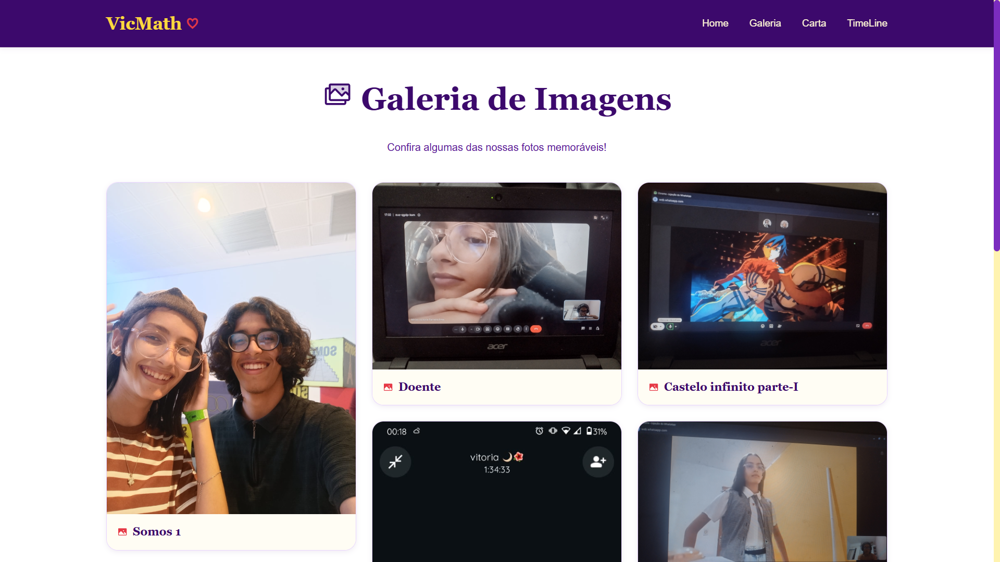
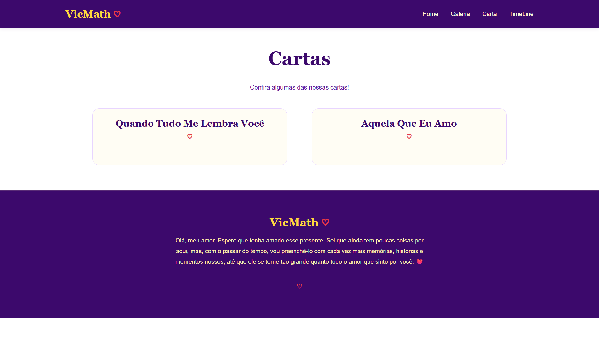
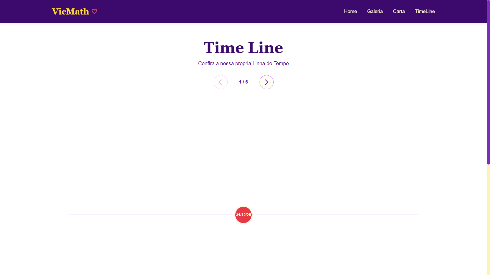

# 💛 VicMath

> Um espaço digital criado para guardar, preservar e celebrar as memórias de Matheus e Victoria.

<div align="center">

**Um presente em forma de site, construído com código, memórias e carinho.** ❤️

### 🌐 [Visite o VicMath](https://vicmath.vercel.app/)

</div>

---

## 💖 Sobre o projeto

O **VicMath** é um projeto pessoal desenvolvido para transformar momentos importantes da história de **Matheus e Victoria** em uma experiência digital.

A aplicação reúne diferentes formas de preservar essas lembranças — **fotografias, cartas, textos, músicas e uma linha do tempo** — em uma interface criada especialmente para o projeto.

Mais do que um exercício de desenvolvimento web, o VicMath nasceu com um propósito pessoal: criar um lugar onde algumas memórias possam ser revisitadas e preservadas ao longo do tempo.

---

## 🎯 Objetivos

O projeto possui dois objetivos principais:

- ❤️ Criar um presente pessoal e significativo para a Victoria;
- 💻 Aplicar e desenvolver conhecimentos de desenvolvimento web utilizando React, TypeScript e CSS.

O VicMath também funciona como um projeto prático de aprendizado, permitindo experimentar **componentização, roteamento, organização de arquivos, responsividade, reutilização de componentes e construção de interfaces**.

---

## ✨ Funcionalidades

Atualmente, o projeto conta com diferentes áreas destinadas à apresentação das memórias:

- 🏠 **Página inicial** — apresenta o projeto e seus principais conteúdos;
- 📸 **Galeria** — reúne fotografias e memórias em uma composição visual;
- 💌 **Cartas** — apresenta cartas e textos escritos para a Victoria;
- 🕰️ **Linha do tempo** — organiza momentos importantes da história em uma timeline horizontal e interativa;
- 🎵 **Músicas** — apresenta músicas especiais por meio de cards reutilizáveis;
- 🧩 **Componentes reutilizáveis** — elementos como imagens, cartas, cards de música e pontos da timeline são separados em componentes próprios;
- 🎨 **Identidade visual personalizada** — interface construída a partir de uma paleta própria de amarelos, vermelhos e roxos;
- ✨ **Interações e animações** — pequenos movimentos e efeitos visuais utilizados para tornar a experiência mais dinâmica;
- 📱 **Interface adaptável** — estilos pensados para diferentes tamanhos de tela.

---

## 🛠️ Tecnologias

| Tecnologia | Utilização |
|---|---|
| **React 19** | Construção da interface e dos componentes |
| **TypeScript** | Tipagem e segurança durante o desenvolvimento |
| **Vite** | Ambiente de desenvolvimento e geração do build |
| **CSS** | Estilização, responsividade e identidade visual |
| **React Router DOM** | Navegação entre as páginas da aplicação |
| **Lucide React** | Ícones utilizados na interface |
| **React Icons** | Biblioteca complementar de ícones |
| **Phosphor Icons** | Biblioteca de ícones utilizada no projeto |
| **ESLint** | Análise e padronização do código |
| **Git** | Controle de versão |
| **GitHub** | Hospedagem do código-fonte |
| **Vercel** | Hospedagem e deploy da aplicação |

---

## 🎨 Identidade visual

A identidade visual do VicMath foi construída a partir de três famílias principais de cores. Cada uma possui um significado dentro do projeto.

### 💛 Amarelo — Victoria

O amarelo representa uma das principais características visuais associadas à Victoria e ocupa um papel importante na identidade do site.

### ❤️ Vermelho — Amor

O vermelho representa **amor, paixão, carinho e intensidade**, sendo utilizado para reforçar a temática romântica do projeto.

### 💜 Roxo — Matheus

O roxo representa uma das cores favoritas do Matheus e completa a identidade visual do VicMath.

A combinação das três famílias procura equilibrar o aspecto **romântico, pessoal e moderno** da aplicação.

---

## 🌈 Paleta de cores

O projeto utiliza **15 cores**, divididas em cinco variações de cada família.

### 💛 Amarelo — Victoria

```css
--yellow-solar: #ffd93d;
--yellow-honey: #f9c74f;
--yellow-golden: #e9b949;
--yellow-cream: #fff3b0;
--yellow-vanilla: #fff8d6;
```

### ❤️ Vermelho — Amor

```css
--red-love: #e63946;
--red-cherry: #d62839;
--red-wide: #9d174d;
--red-rose: #f76c7b;
--red-blush: #fbc4c4;
```

### 💜 Roxo — Matheus

```css
--purple-royal: #7b2cbf;
--purple-imperial: #5a189a;
--purple-plum: #3c096c;
--purple-lavender: #c77dff;
--purple-lilac: #e8d5ff;
```

Além das cores base, o projeto utiliza variáveis semânticas em `Var.css` para facilitar a manutenção e manter a identidade visual consistente entre os componentes.

---

## 🧱 Arquitetura do projeto

A aplicação utiliza uma organização baseada em **páginas, componentes reutilizáveis e estilos separados por responsabilidade**.

```text
Presente-Victoria/
│
├── public/
│   ├── favicon.svg
│   └── icons.svg
│
├── screenshots/
│   ├── Home.png
│   ├── Gallery.png
│   ├── Letter.png
│   └── TimeLine.png
│
├── src/
│   ├── assets/
│   │   ├── Memory/
│   │   └── hero.png
│   │
│   ├── components/
│   │   ├── Content/
│   │   │   └── Components-Content/
│   │   │       ├── Gallery/
│   │   │       ├── Letters/
│   │   │       ├── Music/
│   │   │       └── TimeLine/
│   │   ├── Footer/
│   │   └── Header/
│   │
│   ├── pages/
│   │   ├── Gallery/
│   │   ├── Home/
│   │   ├── Letters/
│   │   ├── Music/
│   │   └── TimeLine/
│   │
│   ├── App.css
│   ├── App.tsx
│   ├── Var.css
│   └── main.tsx
│
├── .gitignore
├── eslint.config.js
├── index.html
├── package.json
├── package-lock.json
├── vite.config.ts
├── vercel.json
└── README.md
```

A separação entre **pages** e **components** permite que cada página funcione como uma composição de componentes menores. Isso fica especialmente evidente na Galeria, Cartas, Linha do Tempo e na nova área de Músicas, que possuem componentes próprios para estruturar seus conteúdos.

---

## 🧭 Navegação

A aplicação é organizada em páginas independentes utilizando **React Router DOM**.

| Rota | Página |
|---|---|
| `/` | Página inicial |
| `/Gallery` | Galeria de memórias |
| `/Cartas` | Cartas e textos |
| `/TimeLine` | Linha do tempo |
| `/Music` | Músicas especiais |

---

## 🎵 Área de músicas

A página de músicas foi estruturada seguindo o mesmo princípio de reutilização utilizado nas outras áreas do projeto.

A implementação possui um componente principal `Music` e um componente `MusicCard`, permitindo que cada música seja apresentada de forma independente sem precisar repetir toda a estrutura visual do card.

Os estilos também são separados entre a área geral (`Music.css`) e os cards individuais (`MusicCard.css`), mantendo a organização e facilitando futuras alterações no design.

---

## 🚀 Como executar localmente

Para executar o projeto em sua máquina, é necessário ter o **Node.js** instalado.

### 1. Clone o repositório

```bash
git clone https://github.com/Math-aMalafaia/Presente-Victoria.git
```

### 2. Acesse a pasta

```bash
cd Presente-Victoria
```

### 3. Instale as dependências

```bash
npm install
```

### 4. Execute o servidor de desenvolvimento

```bash
npm run dev
```

O Vite exibirá no terminal o endereço local para acessar a aplicação.

### Outros comandos

Gerar a versão de produção:

```bash
npm run build
```

Executar a verificação do ESLint:

```bash
npm run lint
```

Visualizar localmente o build de produção:

```bash
npm run preview
```

---

## 🌐 Demonstração

O **VicMath está publicado e disponível online.** 💛

### 👉 [Victoria & Math — VicMath](https://vicmath.vercel.app/)

O projeto é hospedado pela **Vercel** e integrado ao repositório do GitHub para facilitar novos deploys conforme o código evolui.

---

## 📸 Screenshots

Algumas telas principais da aplicação estão disponíveis abaixo.

### 🏠 Página inicial



### 📸 Galeria



### 💌 Cartas



### 🕰️ Linha do tempo



> A área de músicas ainda não possui screenshot dedicada no README.

---

## 🧠 Aprendizados

O VicMath foi desenvolvido também como uma forma de colocar conhecimentos de desenvolvimento web em prática.

Entre os principais conceitos trabalhados estão:

- Componentização com React;
- Desenvolvimento utilizando TypeScript;
- Criação de componentes reutilizáveis;
- Organização de projetos React;
- React Router e navegação entre páginas;
- Responsividade com CSS;
- Criação de uma identidade visual através de variáveis CSS;
- Organização de conteúdo e assets;
- Reutilização de dados para evitar repetição de código;
- Animações e interações de interface;
- Separação entre páginas e componentes;
- Git e GitHub;
- Build e preparação de uma aplicação para produção;
- Deploy e hospedagem de uma aplicação React;
- Desenvolvimento de uma experiência digital a partir de uma ideia pessoal.

---

## 🔮 Próximos passos

Com o site publicado, os próximos passos estão concentrados principalmente em **refinamento, otimização e evolução da experiência**.

### 🔧 Refinamento técnico

- [x] Revisar a navegação e o roteamento em produção;
- [ ] Otimizar imagens de maior tamanho;
- [ ] Remover arquivos que não são mais utilizados;
- [x] Executar revisão final de lint e build;
- [ ] Continuar aprimorando a experiência em telas menores;
- [ ] Monitorar possíveis problemas após o deploy.

### 🎨 Refinamento visual

- [x] Fazer uma última revisão da interface;
- [x] Refinar detalhes de espaçamento, tipografia e animações;
- [x] Testar a experiência em diferentes tamanhos de tela;
- [x] Adicionar screenshots ao README;
- [x] Finalizar o favicon e a identidade visual da aba do navegador.

### 🌐 Publicação

- [x] Gerar o build de produção;
- [x] Publicar a aplicação;
- [x] Adicionar o link oficial do site;
- [x] Realizar o primeiro deploy;
- [x] Integrar o projeto ao fluxo de deploy da Vercel.

---

## 📌 Status do projeto

🟢 **Publicado — em evolução contínua**

A aplicação está publicada e suas principais áreas já estão estruturadas: **Home, Galeria, Cartas, Linha do Tempo e Músicas**.

O foco atual do projeto está em refinamento visual, experiência em diferentes telas, otimização dos assets e pequenos aprimoramentos de código.

---

## ❤️ Autor

Desenvolvido por **Matheus**.

O VicMath é um projeto pessoal criado para a **Victoria**, combinando desenvolvimento web com uma coleção de memórias, textos, músicas e momentos importantes.

---

> **"Algumas memórias merecem mais do que ser lembradas. Merecem ser preservadas."**

<div align="center">

### 💛 VicMath

**Um pequeno espaço digital para uma grande história.**

🌐 **[Acessar o site](https://vicmath.vercel.app/)**

</div>
